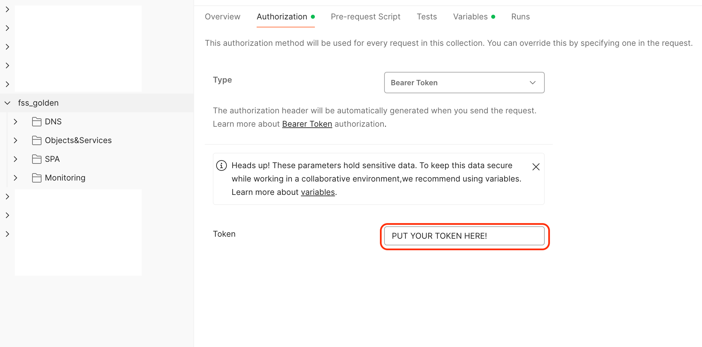
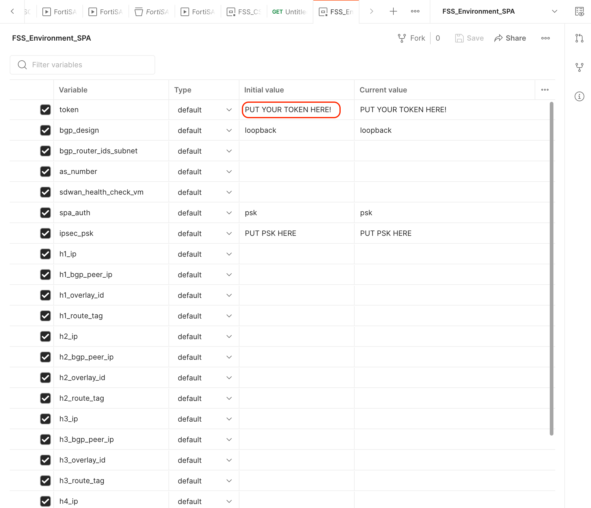

# Welcome Note
This Postman collection provides ways to configure FortiSASE portal via REST API, in automated fashion. 

# Versioning 
Our FortiSASE Postman Collection follow the REST API possibilities presently available on FortiSASE, and hosted at Fortinet [FNDN](https://fndn.fortinet.net/index.php?/fortiapi/2625-fortisase) page. 
As the REST API coverage expands in FortiSASE, so will our Postman collection. 

# Setup Steps: 
- import [FSS Raw Collection](https://raw.githubusercontent.com/fortinet-solutions-cse/fss_postman_collection/main/fss.postman_collection.json) file into your Postman 
- import the supporting [Environment](https://github.com/fortinet-solutions-cse/fss_postman_collection/blob/main/fss_environment.json) file into Postman 
- make sure you add your FSS Bearer token in _-Authorization__ section of the parent folder, as shown in the picture below. How to obtain the token is explained at the following Fortinet [FNDN page](https://fndn.fortinet.net/index.php?/fortiapi/2625-fortisase/2640/).

{#fig:unisase_infra .center width=90%}

- make sure you populate the environment file with necessary variables (```including the bearer token too!```): 

{#fig:unisase_infra .center width=90%}


