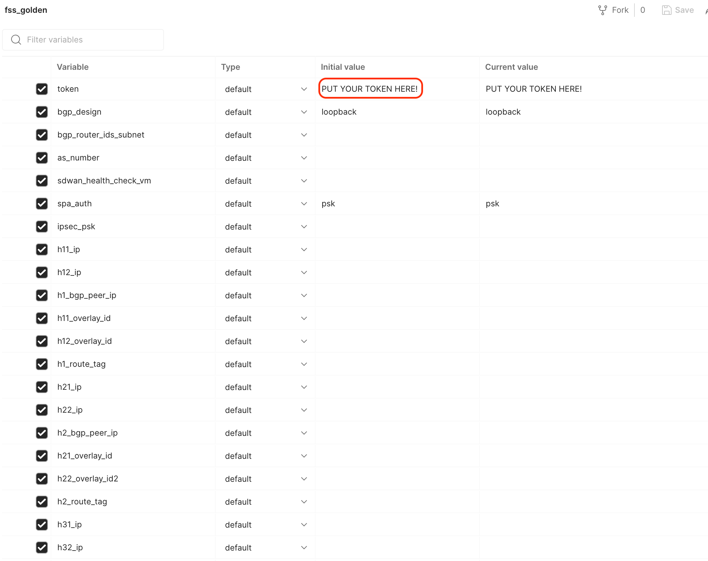

# Welcome Note
This Postman collection provides ways to configure FortiSASE portal via REST API in automated fashion. 

# Versioning 
Our FortiSASE Postman Collection follows the REST API possibilities presently available on FortiSASE, and hosted at Fortinet [FNDN](https://fndn.fortinet.net/index.php?/fortiapi/2625-fortisase) page. 
As the REST API coverage expands in FortiSASE, so will our Postman collection. 

# Setup Steps: 
- import [FSS Raw Collection](https://raw.githubusercontent.com/fortinet-solutions-cse/fss_postman_collection/main/fss.postman_collection.json) file into your Postman 
- import the supporting [Environment](https://github.com/fortinet-solutions-cse/fss_postman_collection/blob/main/fss_environment.json) file into Postman 
- make sure you add your FSS Bearer token in __*Authorization*__ section of the parent folder, as shown in the picture below. How to obtain the token is explained at the following Fortinet [FNDN page](https://fndn.fortinet.net/index.php?/fortiapi/2625-fortisase/2640/).


- make sure you populate the environment file with necessary variables (```including the bearer token too!```): 





# How to Run the Collection
- API collection provides possibility to run configuration in one go. 
- For example, you can run the entire __SPA_Config__ folder, and it will configure the entire SPA section for you, one request after another, by making sure that previous request is completed before the next one is executed. 
- The same applies to the __SPA_Delete__ folder. When you run the whole folder, it will delete one itme after another, staring from Service Connections and finally the Network Configuration. 


